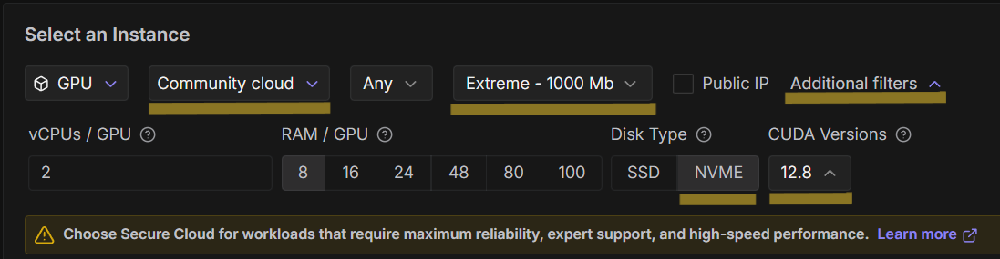
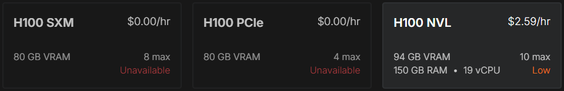
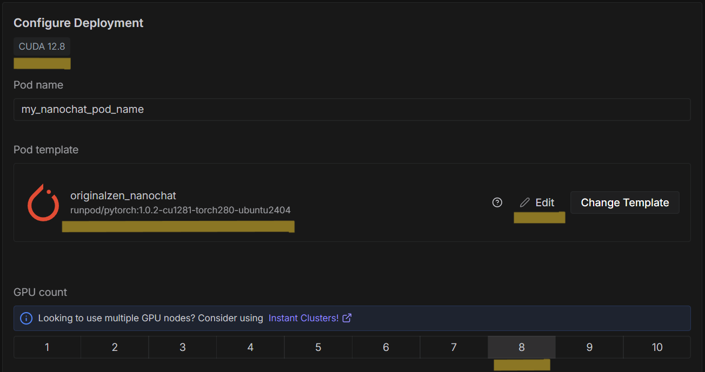
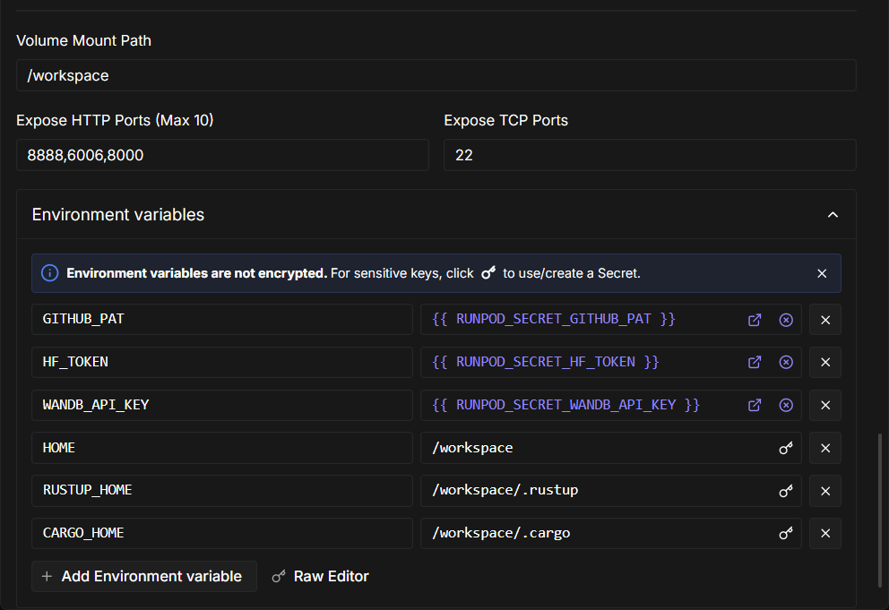
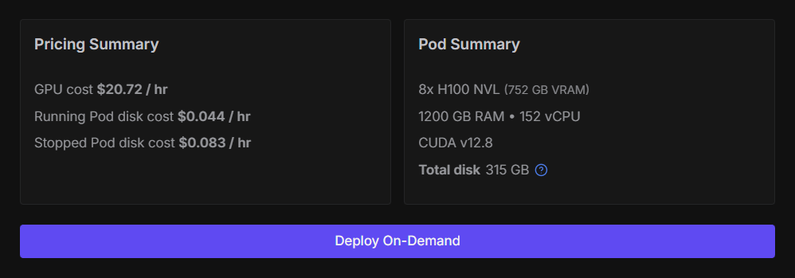

# nanochat


> The best ChatGPT that $100 can buy.

---

## Quick Start: Train Your Own LLM in 4 Hours

**Cost:** ~$100 | **Time:** ~4 hours | **Result:** 500M parameter GPT-2 level chatbot

### Watch Tutorial (Recommended)

Follow along with this comprehensive video guide by Trelis Research:

<a href="https://www.youtube.com/watch?v=qra052AchPE">
  
</a>

**[▶️ Train an LLM from Scratch with Karpathy's Nanochat](https://www.youtube.com/watch?v=qra052AchPE)** (29 minutes)

### Step 1: Get API Keys & Configure SSH Access

#### API Keys

1. **HuggingFace Token** (REQUIRED) - [Create token with "Write" permissions](https://huggingface.co/settings/tokens)
2. **Weights & Biases API Key** (RECOMMENDED) - [Get your API key](https://wandb.ai/authorize)

#### SSH Key Setup (Required for Pod Access)

Before deploying, configure SSH access in Runpod:

1. **Generate SSH key pair** on your local machine:

   ```bash
   # Generate ed25519 key (recommended)
   ssh-keygen -t ed25519 -C "your_email@example.com"

   # Or generate RSA key (alternative)
   ssh-keygen -t rsa -b 4096 -C "your_email@example.com"
   ```

2. **Add public key to Runpod:**
   - Go to Runpod Console → **Settings** → **SSH Public Keys**
   - Click **Add SSH Key**
   - Paste your public key (from `~/.ssh/id_ed25519.pub` or `~/.ssh/id_rsa.pub`)
   - Runpod will inject this key into all your pods automatically

**Note:** Without SSH key setup, you won't be able to access your pod's terminal from your local machine. Otherwise, you'd have to use the Web-based terminal on Runpod.

### Step 2: Deploy & Configure

**Deploy 8x H100 pod on [Runpod](https://runpod.io):**

#### Quick Deploy (Recommended)

Use the pre-configured template with `runpod_onstart.sh` already set up:

**🚀 [One-Click Deploy Template](https://console.runpod.io/deploy?template=q3zrjjxw39)**

Or search for `originalzen_nanochat` in Runpod's public templates.

**Template Details:**

- **Docker Image:** `runpod/pytorch:1.0.2-cu1281-torch280-ubuntu2404`
    - [Runpod Template Reference](https://console.runpod.io/hub/template/runpod-pytorch-2-8-0?id=runpod-torch-v280)
    - [Docker Hub Image Layer Details](https://hub.docker.com/layers/runpod/pytorch/1.0.2-cu1281-torch280-ubuntu2404/images/sha256-4d1721e62b56d345c83b4fd6090664be6daf9312caab5b2e76f23d8231941851)
- **PyTorch:** 2.8.0 | **CUDA:** 12.8.1 | **Ubuntu:** 24.04
- **Size:** 9.8 GB
- **Required:** CUDA 12.8 driver on host (see filtering instructions below)

**⚠️ Important:** The Docker image CUDA version (12.8.1) requires CUDA 12.8 drivers on the host. Filter for the matching driver **CUDA 12.8 exactly** when deploying to ensure compatibility.

#### Deployment Configuration Guide

Follow these steps carefully to configure your pod for optimal performance and cost efficiency.

##### 1. Configure Runpod Secrets (Required First Step)

Before selecting your pod configuration, set up your API keys as encrypted Secrets:


**Go to:** Runpod Console → **Secrets** → **Create Secret**

**Required:**

- `HF_TOKEN` - Your HuggingFace token with "Write" permissions ([get token](https://huggingface.co/settings/tokens))

**Recommended:**

- `WANDB_API_KEY` - Your W&B key for training dashboards ([get key](https://wandb.ai/authorize))

**Optional:**

- `GITHUB_PAT` - Personal access token (only for private forks)
- `GIT_USERNAME` - Your GitHub username if you forked (defaults to `originalzen`)
- `GIT_USER_NAME` - Your author name for git commits (optional)
- `GIT_USER_EMAIL` - Your author email for git commits (optional)

##### 2. Select Cloud Type & Apply Filters



**Cloud Selection:**

- **Community Cloud** (recommended for cost optimization)
    - Provides Internet Speed filtering (critical for fast downloads)
    - Might lower cost with faster bandwidth at the expense of reliability guarantees
    - **Trade-off:** Managed by external hosts, not directly controlled by Runpod
    - **Best for:** Short-term training runs, experimentation, cost-sensitive workloads

- **Secure Cloud** (alternative)
    - Fully managed by Runpod with greater stability
    - Better support and quicker issue resolution
    - Security & compliance filters available
    - No Internet Speed filtering available
    - **Best for:** Long-running or mission-critical workloads requiring greater reliability and availability

**Filter Settings (Community Cloud):**

1. **Internet Speed:** Set to **"Extreme - 1000 Mb/s or higher"**
   - Avoids getting assigned to a node with bandwidth bottlenecking issues
   - Critical for cost optimization on $20+/hour instances

2. **Region:** Select **"Any"** to maximize availability

3. **Additional Filters → CUDA Version:** Select **ONLY 12.8** ✅
   - **Why exactly 12.8?** Docker image requires CUDA 12.8.1, which needs CUDA 12.8 drivers on host machine
   - Older or newer versions may cause initialization failures or compatibility issues
   - **Rule of thumb:** Docker image CUDA version and host machine CUDA drivers should match for maximum reliability

4. **Additional Filters → Disk Type:** Select **NVME** (if available)
   - Significantly faster package installation and extraction
   - Reduces setup time compared to SSD

##### 3. Select GPU Configuration



**⚠️ Availability Note:** With strict filters (Community Cloud + Extreme Speed + CUDA 12.8 + NVME):

- **H100 SXM or PCIe** may be unavailable
- **H100 NVL** may be your only option

**Recommended Selection:**

- **8x H100 NVL** ($20.72 per hour)
- **8 GPUs required** for optimal training speed (~4 hours targeting the `d20` model)

**Alternative Strategy:** If you need greater availability of SXM, try the Secure Cloud instead at the risk of the aforementioned trade-offs.

##### 4. Configure Deployment Settings



**Pod Template:** `originalzen_nanochat` should be preselected if you followed the link:

**🚀 [One-Click Deploy Template](https://console.runpod.io/deploy?template=q3zrjjxw39)**

**GPU Count:** Select **8** GPUs

- Docker image used: `runpod/pytorch:1.0.2-cu1281-torch280-ubuntu2404`
- Click **"Edit"** to inspect template contents (optional):

**What you'll see when inspecting:**

- **Container Start Command:** Equivalent to `runpod_onstart.sh` script
- Sets up SSH, installs dependencies, clones repository automatically

- **Environment Variables:** Shows how Secrets are injected (e.g., `{{ RUNPOD_SECRET_HF_TOKEN }}`)
- **Ports:** HTTP ports 8888, 6006, 8000 exposed for Jupyter/TensorBoard/Web UI
- **Volume Mount Path:** `/workspace` (where repo will be cloned)

**You can override any settings here if needed:**

- Add optional environment variables (e.g., `GIT_USER_NAME`, `GIT_USER_EMAIL`)
- Modify disk sizes
- Change exposed ports



##### 5. Review & Deploy



**Final Checklist:**

- ✅ Secrets configured (HF_TOKEN, WANDB_API_KEY)
- ✅ SSH key added to Runpod account
- ✅ CUDA 12.8 filter applied
- ✅ Community Cloud + Extreme speed selected (or your preferred filters)
- ✅ 8 GPUs selected (H100 SXM/PCIe/NVL)
- ✅ Template: `originalzen_nanochat`

**Cost Estimate:** ~$85-110 for complete 4-hour training run (varies by GPU type and other factors)

**Click "Deploy On-Demand"** to start your pod!

### Step 3: Start Training

**Two deployment options:**

#### Option A: Using Pre-Configured Template (Recommended)

**If you used the one-click deploy template:**

The template automatically handles: cloning repo, installing dependencies (`screen`, `git`, etc.), setting up environment variables.

**SSH into pod and run:**

```bash
# Repository already cloned to /workspace/nanochat by template
cd /workspace/nanochat

# Set your run name for `wandb` and start training in a persistent screen session
export WANDB_RUN=nanochat_d20
screen -L -Logfile speedrun.log -S speedrun bash speedrun.sh
```

**Note:** The video tutorial shows manual `git clone` and `apt-get install screen` commands, but these are **already done** by the template. Just set `WANDB_RUN` and launch `speedrun.sh`!

#### Option B: Manual Deployment (No Template)

**If you're deploying without the template:**

```bash
# SSH into pod and run:
cd /workspace
git clone https://github.com/originalzen/nanochat.git
cd nanochat

# Install screen for session persistence
apt-get update && apt-get install -y screen

# Set run name and start training
export WANDB_RUN=nanochat_d20
screen -L -Logfile speedrun.log -S speedrun bash speedrun.sh
```

**Using your own fork?** Replace `originalzen` with your GitHub username in clone command.

#### Managing Your Training Session

**Screen Commands (Essential):**

```bash
# Detach from screen session (keeps training running)
# Press: Ctrl+A, then D

# Reattach to running session (reconnect after disconnect)
screen -r speedrun

# List all screen sessions
screen -ls

# Monitor training progress (live log tail)
tail -f speedrun.log

# Monitor with auto-scroll (follows output)
tail -f speedrun.log -n 100
```

**Monitoring Progress:**

- **W&B Dashboard:** [wandb.ai](https://wandb.ai) - Real-time metrics, loss curves, FLOPS (if WANDB_API_KEY set)
- **Local Logs:** `tail -f speedrun.log` - Full training output
- **Expected Duration:** ~4 hours for complete training
- **Cost Tracking:** Monitor in Runpod console (target: < $100)

**Training Phases:**

1. **Tokenizer Training** - BPE vocabulary generation
2. **Base Pre-training** - 10B tokens from FineWeb Edu
3. **Mid-training** - Chat data and tool use
4. **Supervised Fine-tuning** - Instruction following
5. **Evaluation** - MMLU, GSM8K, HumanEval benchmarks

**What to Watch For:**

- FLOPS utilization should be > 40% in first 10 minutes (confirms GPU efficiency)
- Loss should decrease steadily during training
- No CUDA out-of-memory errors (if occurs, terminate and adjust `device_batch_size`)

### Step 4: Test Your Model (5 minutes)

**After training completes:**

```bash
source .venv/bin/activate
export NANOCHAT_BASE_DIR="$HOME/.cache/nanochat"
python -m scripts.chat_web
```

Access at: `https://<your-pod-id>-8000.proxy.runpod.net`

**Test prompts:** "What is the capital of France?", "Tell me a joke", "Why is the sky blue?"

### Step 5: Backup Checkpoints (10-20 minutes)

**⚠️ CRITICAL: Backup BEFORE terminating pod!** All data is lost forever when pod terminates.

**What gets generated (total ~8GB):**

| Artifact | Size | Required For | Priority |
|----------|------|--------------|----------|
| **SFT checkpoint** | ~2GB | Chat inference | 🟢 CRITICAL |
| **Tokenizer** | ~1MB | All inference (text encoding/decoding) | 🟢 CRITICAL |
| **Report** | ~50KB | Training metrics & benchmarks | 🟡 RECOMMENDED |
| **Base checkpoint** | ~2GB | Custom fine-tuning, experiments | 🟡 RECOMMENDED |
| **Mid checkpoint** | ~2GB | Research, stage comparison | 🟡 RECOMMENDED |
| **Training logs** | ~10MB | speedrun.log (debugging, learning) | ⚪ OPTIONAL |

**Complete backup (RECOMMENDED - backs up ALL artifacts):**

```bash
source .venv/bin/activate
export NANOCHAT_BASE_DIR="$HOME/.cache/nanochat"

# Replace YourUsername/my-nanochat with your HuggingFace repo

# Critical (SFT + tokenizer + report)
python -m scripts.push_to_hf --stage sft --repo-id YourUsername/my-nanochat --path-in-repo sft/d20
python -m scripts.push_to_hf --model-dir "$NANOCHAT_BASE_DIR/tokenizer" --repo-id YourUsername/my-nanochat --path-in-repo tokenizer/latest
python -m scripts.push_to_hf --model-dir "$NANOCHAT_BASE_DIR/report" --repo-id YourUsername/my-nanochat --path-in-repo report/latest

# Optional but recommended (base + mid for future experiments)
python -m scripts.push_to_hf --stage base --repo-id YourUsername/my-nanochat --path-in-repo base/d20
python -m scripts.push_to_hf --stage mid --repo-id YourUsername/my-nanochat --path-in-repo mid/d20
```

**Minimum backup (time-constrained, ~5 minutes):**

```bash
# Just SFT + tokenizer (~2GB)
python -m scripts.push_to_hf --stage sft --repo-id YourUsername/my-nanochat --path-in-repo sft/d20
python -m scripts.push_to_hf --model-dir "$NANOCHAT_BASE_DIR/tokenizer" --repo-id YourUsername/my-nanochat --path-in-repo tokenizer/latest
```

**Verify HuggingFace uploads:** Visit `https://huggingface.co/YourUsername/my-nanochat` to confirm all folders exist

#### Download Training Logs (Local Backup)

**⚠️ Do NOT upload logs to HuggingFace** (may contain sensitive info like directory paths, usernames)

**Download to your local machine:**

**Option 1: SCP (Command Line)**

```bash
# On your local machine (PowerShell, WSL, or Mac/Linux terminal)
# Get SSH details from Runpod pod → Connect → SSH

# Download speedrun.log
scp -P 22 root@<pod-id>.proxy.runpod.net:/workspace/nanochat/speedrun.log ./

# Download report.md (if not uploaded to HF)
scp -P 22 root@<pod-id>.proxy.runpod.net:/workspace/nanochat/report.md ./
```

**Option 2: WinSCP (GUI, Windows)**

1. Download [WinSCP](https://winscp.net/)
2. Connect using SSH details from Runpod
   - Host: `<pod-id>.proxy.runpod.net`
   - Port: `22`
   - Username: `root`
3. Navigate to `/workspace/nanochat/`
4. Drag `speedrun.log` to your local machine

**What logs contain:**

- Full training output (loss curves, FLOPS, validation metrics)
- Tokenizer training details
- Evaluation results at each stage
- Timing information

**Security note:** Review logs before sharing publicly - they may contain:

- Directory paths (usually benign)
- Environment variable names (no values, safe)
- No API tokens (tokens are never printed to logs)

**Note:** HuggingFace storage is FREE for public models. Back up checkpoints there, logs locally!

### Step 6: Terminate Pod

**Before terminating, ensure backups complete:**

- [x] HuggingFace uploads verified (visit your HF repo)
- [x] Training logs downloaded to local machine (optional)
- [x] Report.md reviewed and saved

**Then:** Terminate pod in Runpod console → Billing stops immediately

**Why backup all checkpoints?**

- **Future experiments:** Base/Mid checkpoints enable custom fine-tuning without re-training
- **Resume training:** Checkpoints include optimizer states for continuation (e.g., monthly $100 runs)
- **Research:** Compare different training stages
- **Educational:** Logs show full training progression for learning
- **Free storage:** No cost to keep checkpoints on HuggingFace (logs stored locally)

---

## Common Deployment Issues & Solutions

### Slow Network Speeds / Long Download Times

**Problem:** Docker image and package dependencies download taking much longer than expected (60+ minutes).

**Root Cause:** Some availability zones might be experiencing extremely limiting bandwidth issues.

**Solution:**

Select the correct cloud type and filters as shown in the deployment guide above:

1. **Use Community Cloud** (provides Internet Speed filtering)
2. **Filter by "Extreme (1000 Mb/s or higher)"** bandwidth
3. **Select NVME Disk Type** (faster package extraction)
4. **Select "Any" region** for maximum availability

**Expected Performance:**

- ✅ Good: ~5 minutes for Docker image + packages (1000 Mb/s+ with NVME)
- ❌ Bad: 60+ minutes (slow zones or HDD disks)

**Cost Impact:** Slow downloads can waste $15-40 in compute time before training even starts!

**Trade-offs to Consider:**

- **Community Cloud + Extreme filters:** Fast speeds but limited GPU availability (often only H100 NVL available)
- **Secure Cloud (no speed filter):** Better GPU availability but risk of slow network assignment
- **Community Cloud (no filters):** Most GPU availability but unpredictable network performance

Experiment with different filter combinations based on your priorities (speed vs availability vs cost).

### Screen Session Lost After Disconnect

**Problem:** SSH disconnected and can't see training output.

**Solution:**

```bash
# Reconnect to your running session
screen -r speedrun

# If that fails, list all sessions
screen -ls

# Then reconnect to specific session
screen -r <session-id>
```

The template uses `-L -Logfile speedrun.log` which saves everything to file, so even if screen is lost, you can review `speedrun.log`.

### Out of Memory Errors

**Problem:** CUDA out of memory during training.

**Solution:**

Edit training scripts to reduce `--device_batch_size`:

```bash
# In speedrun.sh, modify the torchrun commands:
# Change --device_batch_size=32 to 16, 8, 4, or 2
# Example:
torchrun --standalone --nproc_per_node=8 -m scripts.base_train -- --device_batch_size=16
```

Scripts automatically compensate with gradient accumulation, so final results are identical.

---

## Fork Information

This fork integrates convenience enhancements from [TrelisResearch/nanochat](https://github.com/TrelisResearch/nanochat) into the upstream [karpathy/nanochat](https://github.com/karpathy/nanochat) codebase.

**Maintained by:** [@originalzen](https://github.com/originalzen)

### What's Added

**Base:** Latest karpathy/nanochat code

**Enhancements from TrelisResearch:**

- `scripts/push_to_hf.py` - Upload checkpoints to HuggingFace Hub
- `scripts/pull_from_hf.py` - Download checkpoints from HuggingFace Hub
- `runpod_onstart.sh` - My adaptation of the Runpod Container Start Command
- `hf-transfer` + `huggingface-hub` dependencies

### Why This Fork Exists

TrelisResearch added excellent Runpod integration and HuggingFace utilities, but was missing some upstream bug fixes from Karpathy. This fork merges the best of both:

- Latest updates and bug fixes from Karpathy upstream
- Convenience scripts from TrelisResearch (Runpod automation, W&B integration, HF backup workflow)
- Regular upstream sync to stay current

This fork also serves as a learning tool for git workflows, ML/LLM training, and experimentation. Thanks to Andrej Karpathy for making nanochat accessible to everyone, and to Ronan K. McGovern at Trelis Research for the tutorial and scripts.

---

## About nanochat

This repo is a full-stack implementation of an LLM like ChatGPT in a single, clean, minimal, hackable, dependency-lite codebase. nanochat is designed to run on a single 8x H100 node via scripts like [speedrun.sh](speedrun.sh), running the entire pipeline start to end: tokenization, pretraining, finetuning, evaluation, inference, and web serving. nanochat will become the capstone project of the course **LLM101n** being developed by [Eureka Labs](https://eurekalabs.ai).

**Talk to it:** You can try [nanochat d32](https://github.com/karpathy/nanochat/discussions/8) hosted at [nanochat.karpathy.ai](https://nanochat.karpathy.ai/). This 1.9B parameter model was trained for ~$800 (33 hours on 8x H100). While it outperforms GPT-2, it falls short of modern LLMs. These micro models make mistakes, hallucinate, and act childlike - but they're fully yours to configure, tweak, and hack.

---

## Training Results

Expected metrics for speedrun (d20 model, ~500M parameters):

| Metric | BASE | MID | SFT |
|--------|------|-----|-----|
| CORE | ~0.22 | - | - |
| ARC-Easy | - | ~0.36 | ~0.39 |
| GSM8K | - | ~0.03 | ~0.05 |
| HumanEval | - | ~0.07 | ~0.09 |
| MMLU | - | ~0.31 | ~0.32 |

**Training time:** ~3h 47m | View full report: `cat report.md` after training

See Karpathy's walkthrough: [Introducing nanochat](https://github.com/karpathy/nanochat/discussions/1)

---

## Advanced Usage

### Download Pre-Trained Checkpoints

Skip training and use existing checkpoints:

```bash
source .venv/bin/activate
export NANOCHAT_BASE_DIR="$HOME/.cache/nanochat"

# Download SFT model + tokenizer
python -m scripts.pull_from_hf --repo-id YourUsername/nanochat-d20 \
  --repo-path sft/d20 --stage sft --target-tag d20
python -m scripts.pull_from_hf --repo-id YourUsername/nanochat-d20 \
  --repo-path tokenizer/latest --dest-dir "$NANOCHAT_BASE_DIR/tokenizer"

# Run chat interface
python -m scripts.chat_web
```

### Train Bigger Models

**~$300 tier (d26, 12 hours):** Slightly outperforms GPT-2

```bash
# In speedrun.sh, modify:
python -m nanochat.dataset -n 450 &  # More data
torchrun --standalone --nproc_per_node=8 -m scripts.base_train -- --depth=26 --device_batch_size=16
torchrun --standalone --nproc_per_node=8 -m scripts.mid_train -- --device_batch_size=16
```

**~$1000 tier (d32, 41 hours):** 1.9B parameters (like demo at nanochat.karpathy.ai)

### GPU Options & Memory Management

**GPU recommendations:**

- **Best:** 8x H100 SXM (~$24/hr, optimal interconnect)
- **Alternative:** 8x A100 80GB (slower, may cost more overall)
- **Budget:** Single GPU (8x slower, but same results via gradient accumulation)

**Memory management:**

- GPUs with <80GB VRAM: Reduce `--device_batch_size` from `32` to `16`, `8`, `4`, or `2`
- Scripts automatically compensate with gradient accumulation

**CPU/MPS support:** For testing on Macbook/CPU, see [dev/runcpu.sh](dev/runcpu.sh)

### Customization

**Identity Conversations & OpenRouter Setup:**

During mid-training, nanochat downloads `identity_conversations.jsonl` (2.3MB) to inject personality into the model. The training script automatically handles this with a robust multi-tier approach:

1. **Check cache first:** If file already exists from previous run, skip download
2. **Download from TrelisResearch GitHub:** Primary source (free, fast, reliable)
3. **Fallback to local generation:** If download fails, generate using OpenRouter API

**You don't need to do anything for standard training** - the script handles everything automatically. However, if you want to generate custom identity conversations with different personalities, you'll need to set up OpenRouter API access:

**OpenRouter Setup (only for custom generation):**

1. **Sign up for OpenRouter:** [https://openrouter.ai/](https://openrouter.ai/)
2. **Get API key:** Visit [OpenRouter Dashboard](https://openrouter.ai/keys) after signing up
3. **Create token file in repository root:**

   ```bash
   # Create file with your API key
   echo "your-api-key-here" > openroutertoken.txt
   ```

4. **Add to .gitignore (CRITICAL):**

   ```bash
   echo "openroutertoken.txt" >> .gitignore
   ```

**Generate custom identity conversations (advanced):**

```bash
# Only needed if you want custom personalities - not required for standard training!

# Activate virtual environment
source .venv/bin/activate

# Generate new identity_conversations.jsonl
PYTHONPATH=$(pwd) python dev/gen_synthetic_data.py

# The script will:
# - Use your OpenRouter API key from openroutertoken.txt
# - Generate synthetic personality conversations via LLM
# - Save to cache directory for use in next training run
```

**When you need OpenRouter API:**

- ❌ **Standard training:** NOT needed - file downloads automatically from GitHub
- ✅ **Custom personalities:** Generate different conversation styles
- ✅ **Fallback only:** If GitHub download fails (rare)

**Cost:** Typically a few cents per generation. Check [OpenRouter pricing](https://openrouter.ai/models).

**Custom generation use cases:**

- Different personality profiles (formal vs casual, technical vs general)
- Domain-specific conversation patterns
- Multilingual identity injection
- Experimental conversational styles

See [Guide: infusing identity to your nanochat](https://github.com/karpathy/nanochat/discussions/139) for detailed customization strategies.

**Add new abilities:**

- [Guide: counting r in strawberry](https://github.com/karpathy/nanochat/discussions/164)
- Create custom tasks, extend evaluation framework

---

## Fork & Sync

### Fork This Repository

1. Click "Fork" on GitHub
2. Clone: `git clone https://github.com/YourUsername/nanochat.git`
3. (Optional) Update `runpod_onstart.sh` default `GIT_USERNAME` to yours
4. Deploy and train!

### Stay Synced with Upstream

This fork regularly pulls updates from [karpathy/nanochat](https://github.com/karpathy/nanochat):

```bash
git remote add upstream https://github.com/karpathy/nanochat.git
git fetch upstream
git merge upstream/master
git push origin master
```

---

## File Structure

```tree
.
├── LICENSE
├── README.md
├── dev
│   ├── gen_synthetic_data.py       # Example synthetic data for identity
│   ├── generate_logo.html
│   ├── nanochat.png
│   ├── repackage_data_reference.py # Pretraining data shard generation
│   └── runcpu.sh                   # Small example of how to run on CPU/MPS
├── nanochat
│   ├── __init__.py                 # empty
│   ├── adamw.py                    # Distributed AdamW optimizer
│   ├── checkpoint_manager.py       # Save/Load model checkpoints
│   ├── common.py                   # Misc small utilities, quality of life
│   ├── configurator.py             # A superior alternative to argparse
│   ├── core_eval.py                # Evaluates base model CORE score (DCLM paper)
│   ├── dataloader.py               # Tokenizing Distributed Data Loader
│   ├── dataset.py                  # Download/read utils for pretraining data
│   ├── engine.py                   # Efficient model inference with KV Cache
│   ├── execution.py                # Allows the LLM to execute Python code as tool
│   ├── gpt.py                      # The GPT nn.Module Transformer
│   ├── logo.svg
│   ├── loss_eval.py                # Evaluate bits per byte (instead of loss)
│   ├── muon.py                     # Distributed Muon optimizer
│   ├── report.py                   # Utilities for writing the nanochat Report
│   ├── tokenizer.py                # BPE Tokenizer wrapper in style of GPT-4
│   └── ui.html                     # HTML/CSS/JS for nanochat frontend
├── pyproject.toml
├── run1000.sh                      # Train the ~$800 nanochat d32
├── rustbpe                         # Custom Rust BPE tokenizer trainer
│   ├── Cargo.lock
│   ├── Cargo.toml
│   ├── README.md                   # see for why this even exists
│   └── src
│       └── lib.rs
├── scripts
│   ├── base_eval.py                # Base model: calculate CORE score
│   ├── base_loss.py                # Base model: calculate bits per byte, sample
│   ├── base_train.py               # Base model: train
│   ├── chat_cli.py                 # Chat model (SFT/Mid): talk to over CLI
│   ├── chat_eval.py                # Chat model (SFT/Mid): eval tasks
│   ├── chat_rl.py                  # Chat model (SFT/Mid): reinforcement learning
│   ├── chat_sft.py                 # Chat model: train SFT
│   ├── chat_web.py                 # Chat model (SFT/Mid): talk to over WebUI
│   ├── mid_train.py                # Chat model: midtraining
│   ├── tok_eval.py                 # Tokenizer: evaluate compression rate
│   └── tok_train.py                # Tokenizer: train it
├── speedrun.sh                     # Train the ~$100 nanochat d20
├── tasks
│   ├── arc.py                      # Multiple choice science questions
│   ├── common.py                   # TaskMixture | TaskSequence
│   ├── customjson.py               # Make Task from arbitrary jsonl convos
│   ├── gsm8k.py                    # 8K Grade School Math questions
│   ├── humaneval.py                # Misnomer; Simple Python coding task
│   ├── mmlu.py                     # Multiple choice questions, broad topics
│   ├── smoltalk.py                 # Conglomerate dataset of SmolTalk from HF
│   └── spellingbee.py              # Task teaching model to spell/count letters
├── tests
│   └── test_engine.py
│   └── test_rustbpe.py
└── uv.lock
```

See [karpathy/nanochat](https://github.com/karpathy/nanochat#file-structure) for complete descriptions.

---

## Tests

```bash
python -m pytest tests/test_rustbpe.py -v -s
```

---

## Questions & Community

**Ask questions:**

- [DeepWiki](https://deepwiki.com/karpathy/nanochat) - AI-powered code Q&A
- [karpathy/nanochat Discussions](https://github.com/karpathy/nanochat/discussions) - Main community
- [Runpod Discord](https://discord.gg/runpod) - Infrastructure help
- [HuggingFace Forums](https://discuss.huggingface.co) - Model sharing

---

## Contributing

**To this fork:**

- Open issues for deployment guides or fork-specific features
- Submit PRs for enhancements

**To upstream (karpathy/nanochat):**

- Report bugs or request features at [karpathy/nanochat](https://github.com/karpathy/nanochat)
- This fork regularly pulls upstream changes

**LLM Policy (Disclosure):**
When submitting PRs to karpathy/nanochat, declare any parts with substantial LLM contribution you haven't fully verified.

*This fork itself is developed with the assistance of LLMs!*

---

## Credits & Attribution

**Core Implementation:**

- **Andrej Karpathy** - Original design, implementation, ongoing development
    - Repository: [karpathy/nanochat](https://github.com/karpathy/nanochat)
    - Course: [LLM101n](https://github.com/karpathy/LLM101n) (upcoming from Eureka Labs)

**Runpod + W&B Integration & HuggingFace Utilities:**

- **Trelis Research** (Ronan K. McGovern) - Runpod template concept/adaptation, push/pull scripts, tutorial
    - Repository: [TrelisResearch/nanochat](https://github.com/TrelisResearch/nanochat)
    - [Substack Guide](https://trelis.substack.com/p/train-an-llm-from-scratch-with-karpathys)
    - [YouTube Tutorial](https://www.youtube.com/watch?v=qra052AchPE) (29 min)
    - [Trelis Runpod Template](https://console.runpod.io/deploy?template=ikas3s2cii) (original, affiliate link)

**Fork Integration:**

- **originalzen** (@originalzen) - Merged karpathy + TrelisResearch with deployment optimizations
    - Repository: [originalzen/nanochat](https://github.com/originalzen/nanochat)
    - [originalzen Runpod Template](https://console.runpod.io/deploy?template=q3zrjjxw39)

### Acknowledgements (from upstream)

- Name derives from [nanoGPT](https://github.com/karpathy/nanoGPT)
- Inspired by [modded-nanoGPT](https://github.com/KellerJordan/modded-nanogpt)
- Thank you to [HuggingFace](https://huggingface.co/) for fineweb and smoltalk
- Thank you [Lambda](https://lambda.ai/service/gpu-cloud) for compute
- Thank you to Alec Radford for guidance
- Thank you to [@svlandeg](https://github.com/svlandeg) for repo management

---

## Citation

```bibtex
@misc{nanochat,
  author = {Andrej Karpathy},
  title = {nanochat: The best ChatGPT that $100 can buy},
  year = {2025},
  publisher = {GitHub},
  url = {https://github.com/karpathy/nanochat}
}
```

---

## License

MIT (same as upstream)

---

## Links

**Repositories:**

- **This Fork:** [originalzen/nanochat](https://github.com/originalzen/nanochat) ⭐
- **Upstream:** [karpathy/nanochat](https://github.com/karpathy/nanochat)
- **Reference:** [TrelisResearch/nanochat](https://github.com/TrelisResearch/nanochat)

**Resources:**

- [Trelis Video](https://www.youtube.com/watch?v=qra052AchPE) - 29 min tutorial
- [Karpathy Discussions](https://github.com/karpathy/nanochat/discussions)
- [LLM101n Course](https://github.com/karpathy/LLM101n) - upcoming

**Tools:**

- [Runpod Console](https://runpod.io/console/pods)
- [Runpod Template: originalzen_nanochat](https://console.runpod.io/deploy?template=q3zrjjxw39) - One-click deploy
- [HuggingFace Hub](https://huggingface.co)
- [Weights & Biases](https://wandb.ai)

---

## Listen to Thought-Provoking Discussion with Andrej Karpathy and Lex Fridman

<a href="https://www.youtube.com/watch?v=cdiD-9MMpb0">
  
</a>

**[▶️ Andrej Karpathy: Tesla AI, Self-Driving, Optimus, Aliens, and AGI | Lex Fridman Podcast #333](https://www.youtube.com/watch?v=cdiD-9MMpb0)** (3 hours, 29 minutes)

---

*fin*
